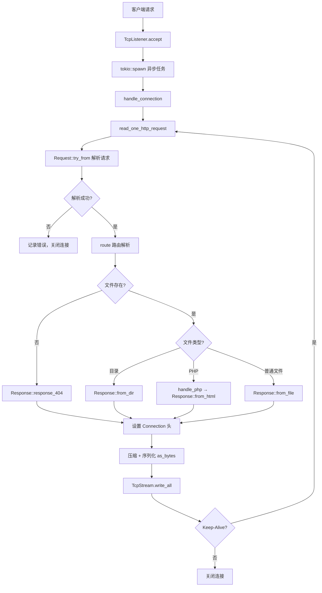

# Webserver 代码框架分析

基于 Rust 语言开发的轻量级异步 Web 服务器，使用 Tokio 运行时实现高并发处理。

> **文档更新时间**：2025-12-29  
> **代码行数统计**：共 1836 行源代码

---

## 📁 项目结构

```
webserver/
├── src/                    # 源代码目录 (8个文件, 1836行)
│   ├── main.rs            # 程序入口与连接处理 (355行)
│   ├── request.rs         # HTTP 请求解析 (160行)
│   ├── response.rs        # HTTP 响应构建 (644行)
│   ├── config.rs          # 配置文件管理 (105行)
│   ├── cache.rs           # 文件缓存系统 (52行)
│   ├── param.rs           # HTTP 常量与类型定义 (224行)
│   ├── util.rs            # 工具函数 (269行)
│   └── exception.rs       # 异常类型定义 (27行)
├── files/                  # 资源文件目录
│   ├── config.toml        # 服务器配置文件
│   ├── html/              # Web 根目录
│   └── log/               # 日志文件目录
├── Cargo.toml             # Rust 项目配置
├── log4rs.yaml            # 日志系统配置
└── README.md              # 项目说明文档
```

---

## 🔧 核心模块详解

### 1. `main.rs` - 程序入口 (355行)

**职责**：服务器启动、TCP连接管理、路由分发、**命令行交互**

| 函数 | 行号 | 描述 |
|------|------|------|
| `main()` | 36-177 | Tokio异步入口，初始化配置、日志、缓存，监听TCP连接 |
| `handle_connection()` | 185-277 | 处理单个TCP连接，支持 **HTTP Keep-Alive** 持久连接 |
| `read_one_http_request()` | 284-319 | 从TCP流读取完整HTTP请求头（到 `\r\n\r\n` 为止） |
| `route()` | 332-354 | 路由解析，将URL路径映射到文件系统路径 |

**命令行控制** (代码位置: `main.rs:107-148`)：
```
在运行服务器的终端中直接输入命令：
├── help    → 显示帮助信息
├── status  → 查看当前活跃连接数
└── stop    → 设置停机标志（需再发起一次连接后生效）
```

**状态监控机制** (代码位置: `main.rs:103-106`)：
- `shutdown_flag`: `Arc<Mutex<bool>>` 停机标志
- `active_connection`: `Arc<Mutex<u32>>` 活跃连接计数器

**核心流程**：
```
启动 → 加载配置 → 初始化日志 → 检测PHP → 创建缓存 → 监听端口
     ↓
接收连接 → spawn异步任务 → 解析Request → 路由 → 构建Response → 发送
     ↓
支持 Keep-Alive 循环处理多个请求 (main.rs:195-276)
```

---

### 2. `request.rs` - HTTP请求解析 (160行)

**职责**：解析HTTP请求报文

```rust
// request.rs:9-17
pub struct Request {
    method: HttpRequestMethod,         // GET/HEAD/OPTIONS/POST
    path: String,                      // 请求路径
    version: HttpVersion,              // HTTP/1.0 或 HTTP/1.1
    user_agent: String,                // 客户端标识
    accept_encoding: Vec<HttpEncoding>,// 支持的压缩编码 (Gzip/Deflate/Br)
    connection_close: bool,            // Connection: close 标志
    connection_keep_alive: bool,       // Connection: keep-alive 标志
}
```

**核心方法**：
| 方法 | 行号 | 描述 |
|------|------|------|
| `try_from()` | 24-118 | 从字节流解析HTTP请求，支持 HTTP/1.0 和 HTTP/1.1 |
| `should_keep_alive()` | 151-159 | 判断是否应保持连接（HTTP/1.1默认keep-alive，HTTP/1.0默认close） |
| `path()` | 128-130 | 获取请求路径 |
| `method()` | 133-135 | 获取请求方法 |
| `accept_encoding()` | 143-145 | 获取客户端支持的压缩编码 |

---

### 3. `response.rs` - HTTP响应构建 (644行)

**职责**：构建并序列化HTTP响应报文

```rust
// response.rs:39-51
pub struct Response {
    version: HttpVersion,
    status_code: u16,
    information: String,
    content_type: Option<String>,
    content_length: u64,
    date: DateTime<Utc>,
    content_encoding: Option<HttpEncoding>,
    server_name: String,
    allow: Option<Vec<HttpRequestMethod>>,
    connection: Option<&'static str>,      // 新增：Connection 响应头
    content: Option<Bytes>,
}
```

**核心方法**：
| 方法 | 行号 | 描述 |
|------|------|------|
| `from_file()` | 92-165 | 从文件构建响应（支持缓存读取，headonly优化） |
| `from_dir()` | 226-283 | 目录列表响应（动态HTML生成） |
| `from_status_code()` | 176-214 | 状态码页面（如404、405、500） |
| `from_html()` | 296-317 | 从HTML代码构建响应（PHP支持） |
| `from()` | 391-480 | **主入口**：根据路径类型分发到上述方法 |
| `as_bytes()` | 483-559 | 响应序列化为字节流 |
| `set_connection()` | 332-335 | 设置 Connection 响应头 |

**压缩策略** (代码位置: `response.rs:617-625`)：
```rust
// 优先级：Gzip > Deflate > 无压缩
// 注：Brotli 太慢已禁用（代码注释说明）
fn decide_encoding(accept_encoding: &Vec<HttpEncoding>) -> Option<HttpEncoding> {
    if accept_encoding.contains(&HttpEncoding::Gzip) {
        Some(HttpEncoding::Gzip)
    } else if accept_encoding.contains(&HttpEncoding::Deflate) {
        Some(HttpEncoding::Deflate)
    } else {
        None
    }
}
```

---

### 4. `config.rs` - 配置管理 (105行)

**职责**：加载和管理服务器配置

```rust
// config.rs:22-28
pub struct Config {
    www_root: String,      // Web根目录路径
    port: u16,             // 监听端口
    worker_threads: usize, // 工作线程数 (0=自动检测CPU核心数)
    cache_size: usize,     // 缓存容量 (不能为0，最小值5)
    local: bool,           // true=127.0.0.1, false=0.0.0.0
}
```

**配置文件示例** (`files/config.toml`)：
```toml
www_root = "./files/html/"
port = 7878
worker_threads = 0     # 0表示自动检测CPU核心数 (config.rs:68-70)
cache_size = 10
local = true           # true=127.0.0.1, false=0.0.0.0
```

---

### 5. `cache.rs` - 文件缓存 (52行)

**职责**：FIFO 文件缓存，减少磁盘I/O

```rust
// cache.rs:8-13
pub struct FileCache {
    cache: HashMap<String, Bytes>,
    capacity: usize,   // 最大缓存数
    size: usize,       // 当前缓存数
    first: String,     // 最早缓存的文件名（用于FIFO淘汰）
}
```

**核心方法**：
| 方法 | 行号 | 描述 |
|------|------|------|
| `from_capacity()` | 17-27 | 创建指定容量的缓存（容量不能为0） |
| `push()` | 33-43 | 添加缓存（满时FIFO淘汰最早的） |
| `find()` | 49-51 | 查找缓存 |

**缓存策略说明**：
- 缓存中**始终保存未压缩原文**，避免不同客户端 encoding 不一致 (`response.rs:106`)
- 目录列表也会被缓存 (`response.rs:270-271`)

---

### 6. `param.rs` - 常量与类型定义 (224行)

**职责**：定义HTTP协议相关常量和枚举类型

**常量** (行号: 5-9)：
| 常量 | 值 | 描述 |
|------|------|------|
| `HTML_INDEX` | `"files/html/index.html"` | 默认首页路径 |
| `SERVER_NAME` | `"eslzzyl-webserver"` | 服务器名称标识 |
| `CRLF` | `"\r\n"` | HTTP换行符 |

**静态映射**：
- `STATUS_CODES` (行号: 21-76)：HTTP状态码 → 描述文本（1xx~5xx共40+个）
- `MIME_TYPES` (行号: 78-171)：文件扩展名 → Content-Type（88种）
- `ALLOWED_METHODS` (行号: 11-19)：`[Get, Head, Options]`

**枚举类型**：
```rust
// param.rs:173-192
pub enum HttpVersion { V1_0, V1_1 }  // 支持 HTTP/1.0 和 HTTP/1.1
pub enum HttpRequestMethod { Get, Head, Options, Post }
pub enum HttpEncoding { Gzip, Deflate, Br }
```

---

### 7. `util.rs` - 工具函数 (269行)

**职责**：HTML生成、文件处理、PHP执行

**HtmlBuilder 结构体** (行号: 17-196)：
| 方法 | 行号 | 描述 |
|------|------|------|
| `from_status_code()` | 41-73 | 生成状态码页面HTML |
| `from_dir()` | 83-176 | 生成目录列表HTML（表格排版，支持超链接） |
| `build()` | 179-195 | 输出完整HTML文档 |

**辅助函数**：
| 函数 | 行号 | 描述 |
|------|------|------|
| `format_file_size()` | 205-216 | 格式化文件大小 (B/KB/MB/GB/TB) |
| `sort_dir_entries()` | 223-236 | 目录排序（文件夹优先，按名称排序） |
| `handle_php()` | 239-256 | 调用 `php` 命令执行PHP脚本 |

---

### 8. `exception.rs` - 异常类型 (27行)

**职责**：定义服务器运行时异常

```rust
// exception.rs:4-11
pub enum Exception {
    RequestIsNotUtf8,          // 请求非UTF-8编码
    UnSupportedRequestMethod,  // 不支持的请求方法
    UnsupportedHttpVersion,    // 不支持的HTTP版本
    FileNotFound,              // 文件未找到 (404)
    PHPExecuteFailed,          // PHP解释器调用失败
    PHPCodeError,              // PHP代码执行错误
}
```

---

## 🔄 请求处理流程



---

## 📦 核心依赖

| 依赖 | 用途 |
|------|------|
| `tokio` | 异步运行时 (multi-thread) |
| `bytes` | 零拷贝字节缓冲区 |
| `flate2` | Gzip/Deflate 压缩 |
| `brotli` | Brotli 压缩 (已弃用于实际使用) |
| `chrono` | 时间处理 (RFC2822格式) |
| `log4rs` | 日志系统 |
| `regex` | 正则表达式 (PHP版本检测) |
| `serde` + `toml` | 配置文件解析 |
| `num_cpus` | 自动检测CPU核心数 |
| `lazy_static` | 静态HashMap初始化 |

---

## ⚡ 特性总结

| 功能 | 状态 | 代码依据 |
|------|------|----------|
| HTTP/1.0 协议 | ✅ 支持 | `request.rs:53` |
| HTTP/1.1 协议 | ✅ 支持 | `request.rs:54` |
| HTTP Keep-Alive | ✅ 支持 | `request.rs:151-159`, `main.rs:195-276` |
| GET 方法 | ✅ 支持 | `request.rs:40` |
| HEAD 方法 | ✅ 支持 | `request.rs:41`, `response.rs:420-426` |
| OPTIONS 方法 | ✅ 支持 | `request.rs:42`, `response.rs:410-417` |
| POST 方法 | ⚠️ 仅解析 | `request.rs:43` (无处理逻辑) |
| Gzip 压缩 | ✅ 支持 | `response.rs:587-591` |
| Deflate 压缩 | ✅ 支持 | `response.rs:592-596` |
| Brotli 压缩 | ⚠️ 已禁用 | `response.rs:617-624` 注释说明太慢 |
| 文件缓存 | ✅ FIFO策略 | `cache.rs` |
| 目录列表 | ✅ 动态HTML | `util.rs:83-176` |
| PHP 执行 | ✅ 通过系统调用 | `util.rs:239-256` |
| 命令行控制 | ✅ help/status/stop | `main.rs:107-148` |
| 服务器状态监控 | ✅ 活跃连接计数 | `main.rs:104-105`, `main.rs:133-137` |
| HTTPS | ❌ 不支持 | - |
| 动态路由 | ❌ 不支持 | - |

---

## 📖 快速开始

```bash
# 构建
cargo build --release

# 运行
cargo run --release

# 访问
# 浏览器打开 http://127.0.0.1:7878

# 命令行交互（在运行服务器的终端中输入）
help     # 显示帮助
status   # 查看连接数
stop     # 停止服务器
```

---

*文档生成时间：2025-12-29 | 基于源代码实际分析*
