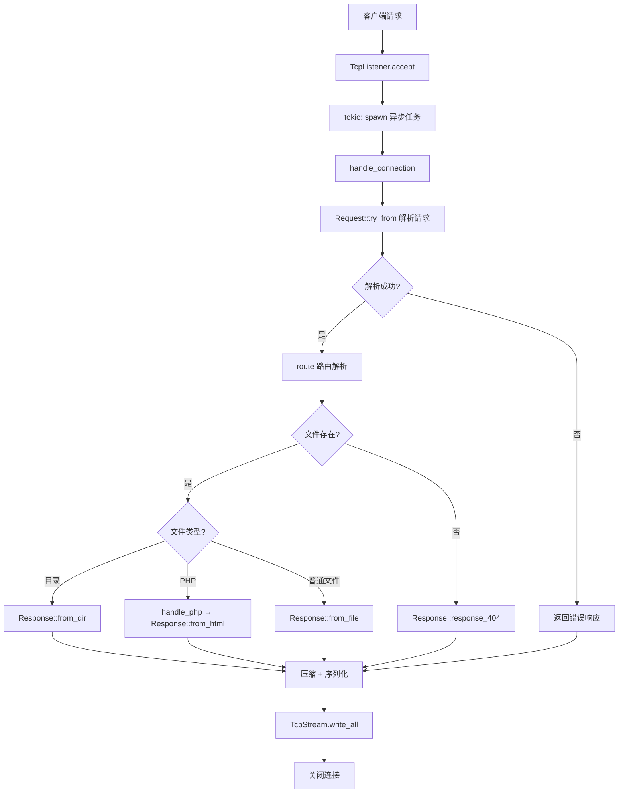

# Webserver 代码框架分析

基于 Rust 语言开发的轻量级异步 Web 服务器，使用 Tokio 运行时实现高并发处理。

---

## 📁 项目结构

```
webserver/
├── src/                    # 源代码目录
│   ├── main.rs            # 程序入口与连接处理
│   ├── request.rs         # HTTP 请求解析
│   ├── response.rs        # HTTP 响应构建
│   ├── config.rs          # 配置文件管理
│   ├── cache.rs           # 文件缓存系统
│   ├── param.rs           # HTTP 常量与类型定义
│   ├── util.rs            # 工具函数
│   └── exception.rs       # 异常类型定义
├── files/                  # 资源文件目录
│   ├── config.toml        # 服务器配置文件
│   ├── html/              # Web 根目录
│   └── log/               # 日志文件目录
├── Cargo.toml             # Rust 项目配置
├── log4rs.yaml            # 日志系统配置
└── README.md              # 项目说明文档
```

---

## 🔧 核心模块详解

### 1. `main.rs` - 程序入口 (295行)

**职责**：服务器启动、TCP连接管理、路由分发

| 函数 | 描述 |
|------|------|
| `main()` | Tokio异步入口，初始化配置、日志、缓存，监听TCP连接 |
| `handle_connection()` | 处理单个TCP连接，解析请求并生成响应 |
| `route()` | 路由解析，将URL路径映射到文件系统路径 |

**核心流程**：
```
启动 → 加载配置 → 初始化日志 → 创建缓存 → 监听端口
     ↓
接收连接 → spawn异步任务 → 解析Request → 路由 → 构建Response → 发送
```

---

### 2. `request.rs` - HTTP请求解析 (121行)

**职责**：解析HTTP请求报文

```rust
pub struct Request {
    method: HttpRequestMethod,    // GET/HEAD/OPTIONS/POST
    path: String,                 // 请求路径
    version: HttpVersion,         // HTTP版本 (目前仅支持1.1)
    user_agent: String,           // 客户端标识
    accept_encoding: Vec<HttpEncoding>,  // 支持的压缩编码
}
```

**核心方法**：
| 方法 | 描述 |
|------|------|
| `try_from(buffer)` | 从字节流解析HTTP请求 |
| `path()` | 获取请求路径 |
| `method()` | 获取请求方法 |
| `accept_encoding()` | 获取客户端支持的压缩编码 |

---

### 3. `response.rs` - HTTP响应构建 (623行)

**职责**：构建并序列化HTTP响应报文

```rust
pub struct Response {
    version: HttpVersion,
    status_code: u16,
    information: String,
    content_type: Option<String>,
    content_length: usize,
    date: DateTime<Utc>,
    content_encoding: HttpEncoding,
    server_name: String,
    allow: Vec<HttpRequestMethod>,
    content: Option<Bytes>,
}
```

**核心方法**：
| 方法 | 描述 |
|------|------|
| `from_file()` | 从文件构建响应（支持缓存读取） |
| `from_dir()` | 目录列表响应（动态HTML生成） |
| `from_status_code()` | 状态码页面（如404、500） |
| `from_html()` | 从HTML代码构建响应（PHP支持） |
| `as_bytes()` | 响应序列化为字节流 |

**压缩支持**：Gzip / Deflate / Brotli

---

### 4. `config.rs` - 配置管理 (105行)

**职责**：加载和管理服务器配置

```rust
pub struct Config {
    www_root: String,      // Web根目录路径
    port: u16,             // 监听端口
    worker_threads: usize, // 工作线程数 (0=自动)
    cache_size: usize,     // 缓存容量
    local: bool,           // 是否本地模式
}
```

**配置文件示例** (`files/config.toml`)：
```toml
www_root = "./files/html/"
port = 7878
worker_threads = 0     # 0表示自动检测CPU核心数
cache_size = 10
local = true           # true=127.0.0.1, false=0.0.0.0
```

---

### 5. `cache.rs` - 文件缓存 (52行)

**职责**：FIFO文件缓存，减少磁盘I/O

```rust
pub struct FileCache {
    cache: HashMap<String, Bytes>,
    capacity: usize,   // 最大缓存数
    size: usize,       // 当前缓存数
    first: String,     // 最早缓存的文件名（用于淘汰）
}
```

**核心方法**：
| 方法 | 描述 |
|------|------|
| `from_capacity()` | 创建指定容量的缓存 |
| `push()` | 添加缓存（满时淘汰最早的） |
| `find()` | 查找缓存 |

---

### 6. `param.rs` - 常量与类型定义 (222行)

**职责**：定义HTTP协议相关常量和枚举类型

**常量**：
- `SERVER_NAME`: 服务器名称标识
- `CRLF`: HTTP换行符
- `HTML_INDEX`: 默认首页路径

**静态映射**：
- `STATUS_CODES`: HTTP状态码 → 描述文本
- `MIME_TYPES`: 文件扩展名 → Content-Type

**枚举类型**：
```rust
pub enum HttpVersion { V1_1 }
pub enum HttpRequestMethod { Get, Head, Options, Post }
pub enum HttpEncoding { Gzip, Deflate, Br }
```

---

### 7. `util.rs` - 工具函数 (269行)

**职责**：HTML生成、文件处理、PHP执行

**HtmlBuilder 结构体**：
- `from_status_code()`: 状态码页面HTML
- `from_dir()`: 目录列表HTML
- `build()`: 输出完整HTML

**辅助函数**：
| 函数 | 描述 |
|------|------|
| `format_file_size()` | 格式化文件大小 (B/KB/MB/GB/TB) |
| `sort_dir_entries()` | 目录排序（文件夹优先） |
| `handle_php()` | 调用PHP解释器执行脚本 |

---

### 8. `exception.rs` - 异常类型 (27行)

**职责**：定义服务器运行时异常

```rust
pub enum Exception {
    RequestIsNotUtf8,          // 请求非UTF-8编码
    UnSupportedRequestMethod,  // 不支持的请求方法
    UnsupportedHttpVersion,    // 不支持的HTTP版本
    FileNotFound,              // 文件未找到
    PHPExecuteFailed,          // PHP解释器调用失败
    PHPCodeError,              // PHP代码执行错误
}
```

---

## 🔄 请求处理流程



---

## 📦 核心依赖

| 依赖 | 版本 | 用途 |
|------|------|------|
| `tokio` | 1.36.0 | 异步运行时 |
| `bytes` | 1.6.0 | 字节缓冲区 |
| `flate2` | 1.0.28 | Gzip/Deflate压缩 |
| `brotli` | 3.5.0 | Brotli压缩 |
| `chrono` | 0.4.35 | 时间处理 |
| `log4rs` | 1.3.0 | 日志系统 |
| `regex` | 1.10.4 | 正则表达式 |
| `serde` | 1.0.197 | 序列化框架 |
| `toml` | 0.8.12 | TOML配置解析 |

---

## ⚡ 特性总结

| 功能 | 状态 |
|------|------|
| HTTP/1.1 协议 | ✅ 支持 |
| GET/HEAD/OPTIONS 方法 | ✅ 支持 |
| POST 方法 | ⚠️ 部分 (仅解析，无处理逻辑) |
| Gzip/Deflate/Brotli 压缩 | ✅ 支持 |
| 文件缓存 | ✅ FIFO策略 |
| 目录列表 | ✅ 动态HTML |
| PHP 执行 | ✅ 通过系统调用 |
| HTTPS | ❌ 不支持 |
| 动态路由 | ❌ 不支持 |

---

## 📖 快速开始

```bash
# 构建
cargo build --release

# 运行
cargo run --release

# 访问
# 浏览器打开 http://127.0.0.1:7878
```

---

*文档生成时间：2025-12-28*
